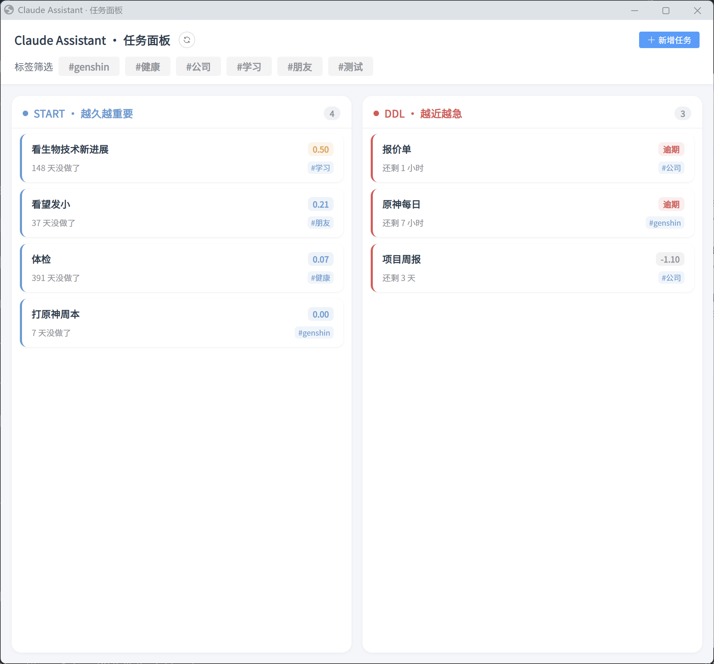

<div align="center">

# Claude Assistant

**一个常驻托盘的「双驱动」任务助理 —— Claude Code 的手脚，不是你的又一个清单 App**

[](https://www.python.org/)
[](https://fastapi.tiangolo.com/)
[](https://vuejs.org/)
[](https://docs.astral.sh/uv/)
[](LICENSE)



*START 越久越重要 · DDL 越近越急 —— 两栏看尽所有该做的事*

</div>

---

## 我们受够了任务管理

清单、日历、每日计划、四象限、GTD、看板……

工具换了一个又一个，待办清单却越列越长，最后变成一份**再也不敢打开的忏悔录**。

停下来想，它们真的不同吗？剥掉外壳，所有「要做的事」其实只有两种：

- **越久越该做的** —— 体检、看朋友、体检报告躺在那 300 天了
- **越近越急迫的** —— 周五要交的方案、今晚截止的报名

就这两种。剩下的全是噪音。

**Claude Assistant 透过现象看本质，把任务管理抽离成这两条最朴素的驱动**，然后让 AI 在后台替你盯着，到点把你拉回正轨。

---

## 两种驱动，两个公式

| | START · 越久越重要 | DDL · 越近越急 |
|---|---|---|
| **什么事** | 没有硬截止，但拖不得 | 有明确 deadline |
| **怎么催** | `log(距上次 / 周期)` | `-log(剩余)` |
| **例子** | 体检、回访、看爸妈 | 方案、报名、还书 |

重要性不是拍脑袋的优先级数字，而是**时间自然发酵出来的**。拖得越久、离得越近，它就越无法忽视。

周期任务做完自动续上下一个；催办分三档（提醒 → 催办 → 紧急），越不理越上头。

---

## 它不是替你思考，是替 Claude 盯着你

```
你  ──► Claude Code(大脑:决策、记忆、对话)
                    │
                    │  到点该催了
                    ▼
         Claude Assistant(哑终端:记任务、算重要性、弹窗、把你拉回对话)
```

- Claude Code 一关窗口就「失忆」，它在托盘里**替你记住那些该做的事**。
- 到点弹窗，一键**把你拽回和 Claude 的对话**，思路无缝接上。
- 它从不替你做决定——**助手，不是替代**。

---

## 一览

- 🧠 **双驱动任务模型** —— 看透所有任务管理工具的本质
- 📮 **HTTP 接口** —— FastAPI 自动文档，AI / 前端 / 弹窗共用一套逻辑
- 🖥️ **WebUI 面板** —— Vue 3 + Element Plus，增删改查、提醒记录、标签筛选
- 📌 **托盘常驻** —— 无窗口后台运行，左键开面板，端口被占自动顺延
- 🔁 **周期任务** —— 完成自动克隆，生活琐事永不漏
- 📊 **推送生命周期** —— 三档催促 + 节流 + 完整流水，催你有分寸

---

## 快速开始

**环境**：[uv](https://docs.astral.sh/uv/) + Node / pnpm

```bash
uv sync                                # 后端依赖(锁版本,走阿里源)
cd frontend && pnpm install && pnpm build && cd ..   # 构建前端
启动.bat                               # 常驻 + 托盘,无窗口运行
```

托盘左键 → 打开面板。开发模式：`uv run python main.py` + `cd frontend && pnpm dev`。

> AI 接入：读 `data/panel_port` 拿端口 → 拉 `/openapi.json` 自查接口 → 直接用。绝不直接碰数据库。

---

## 深入了解

设计、推导与实现细节都在文档里：

- [需求](docs/requirements.md) · [架构](docs/architecture.md) · [任务模型](docs/task-system.md)
- [推送生命周期](docs/lifecycle.md) · [表结构与接口](docs/schema.md) · [存储选型](docs/storage.md)

---

<div align="center">

## 来一起玩

🚧 **项目仍在活跃开发中** —— 雏形已跑通，想法还很多。

如果你也受够了臃肿的任务管理，认同「回归本质」这套思路，
**欢迎体验、提 Issue、丢 PR，或者只是来聊聊。**

⭐ 如果它戳中了你，点个 Star 就是最大的鼓励。

</div>
